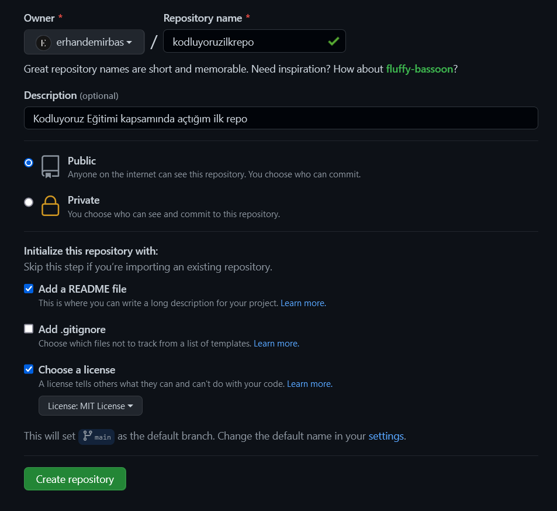

# kodluyoruz İlk Repo
[Kodluyoruz](https://www.kodluyoruz.org) Eğitimi kapsamında açtığım ilk repo.


## Installation
---
Önce projeyi klonlayın.
## Usage
---
Projeyi cloneladıktan sonra Visual Studio Code programında açınız.

Linux için:
```bash
cd kodluyoruzilkrepo
code .
```
## Contributing
---
Pull requestler kabul edilir. Büyük değişiklikler için, lütfen önce neyi değiştirmek istediğinizi tartışmak için bir konu açınız.
## License
---
[MIT](https://choosealicense.com/licenses/mit/)